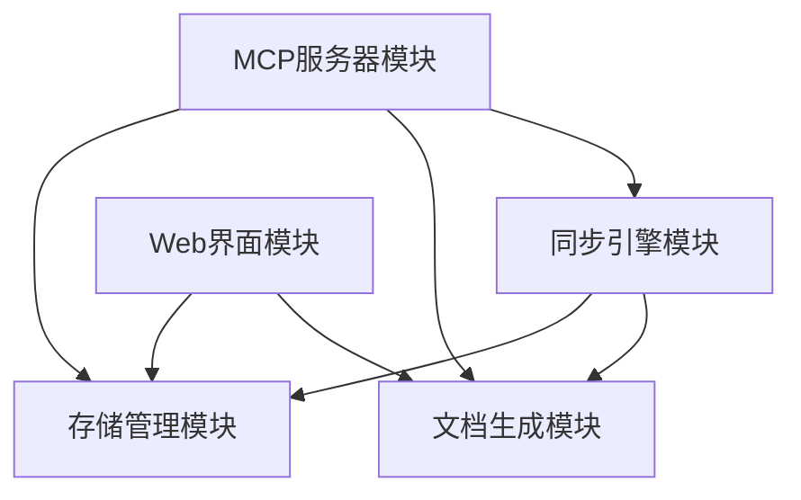

# apiDocMcp 实现文档

## 1. 自顶向下的模块划分

根据apiDocMcp设计文档，我们将系统划分为以下主要模块：

1. **MCP服务器模块**：实现MCP协议，提供API文档管理的工具接口
2. **存储管理模块**：处理API文档的结构化存储和读写操作
3. **文档生成模块**：将结构化数据转换为Markdown格式的文档
4. **同步引擎模块**：协调结构化存储和文档化存储的一致性
5. **Web界面模块**：提供用户友好的文档浏览和搜索界面

## 2. 自顶向下的模块依赖/调用关系



## 3. 各模块功能简单描述及代码框架

### 3.1 MCP服务器模块

**功能描述**：

- 实现MCP协议，提供工具接口
- 处理API文档的CRUD操作
- 管理用户认证和权限控制

**代码框架**：

```javascript
// server.js - MCP服务器入口
const { createServer } = require('@anthropic-ai/mcp-sdk');
const tools = require('./tools');

class McpServer {
  constructor(config) {
    this.config = config;
    this.server = null;
  }

  initialize() {
    this.server = createServer({
      tools: [
        tools.addModule,
        tools.addApi,
        tools.updateModule,
        tools.updateApi,
        tools.listModules,
        tools.listApis,
        tools.getModuleDetails,
        tools.getApiDetails
      ],
      auth: this.config.auth
    });
  }

  start() {
    const port = this.config.port || 3000;
    this.server.listen(port, () => {
      console.log(`MCP Server running on port ${port}`);
    });
  }
}

module.exports = McpServer;
```

```javascript
// tools/index.js - MCP工具定义
const addModule = require('./addModule');
const addApi = require('./addApi');
const updateModule = require('./updateModule');
const updateApi = require('./updateApi');
const listModules = require('./listModules');
const listApis = require('./listApis');
const getModuleDetails = require('./getModuleDetails');
const getApiDetails = require('./getApiDetails');

module.exports = {
  addModule,
  addApi,
  updateModule,
  updateApi,
  listModules,
  listApis,
  getModuleDetails,
  getApiDetails
};
```

```javascript
// tools/addModule.js - 新增模块工具实现
const { StorageManager } = require('../storage');
const { DocumentGenerator } = require('../document');
const { SyncEngine } = require('../sync');

const addModule = {
  name: 'addModule',
  description: '创建新的API模块',
  inputSchema: {
    type: 'object',
    properties: {
      moduleName: {
        type: 'string',
        description: '模块的唯一标识名称'
      },
      description: {
        type: 'string',
        description: '模块的详细描述'
      }
    },
    required: ['moduleName', 'description']
  },
  async handler(input, context) {
    try {
      // 1. 创建模块记录
      const storage = new StorageManager();
      const moduleId = await storage.createModule(input);
      
      // 2. 生成Markdown文档
      const docGen = new DocumentGenerator();
      await docGen.generateModuleDoc(moduleId);
      
      // 3. 同步存储
      const syncEngine = new SyncEngine();
      await syncEngine.syncModule(moduleId);
      
      return {
        success: true,
        moduleId,
        message: '模块创建成功'
      };
    } catch (error) {
      return {
        success: false,
        message: `模块创建失败: ${error.message}`
      };
    }
  }
};

module.exports = addModule;
```

### 3.2 存储管理模块

**功能描述**：

- 处理结构化数据的读写
- 实现版本控制和冲突解决
- 提供数据索引和查询优化

**代码框架**：

```javascript
// storage/index.js - 存储管理器入口
const FileStorage = require('./fileStorage');
const DatabaseStorage = require('./databaseStorage');

class StorageManager {
  constructor(config = {}) {
    this.config = config;
    this.storageType = config.storageType || 'file';
    
    // 根据配置选择存储实现
    if (this.storageType === 'file') {
      this.storage = new FileStorage(config);
    } else if (this.storageType === 'database') {
      this.storage = new DatabaseStorage(config);
    } else {
      throw new Error(`不支持的存储类型: ${this.storageType}`);
    }
  }

  async createModule(moduleData) {
    return this.storage.createModule(moduleData);
  }

  async getModule(moduleId) {
    return this.storage.getModule(moduleId);
  }

  async updateModule(moduleId, moduleData) {
    return this.storage.updateModule(moduleId, moduleData);
  }

  async listModules(filter = {}) {
    return this.storage.listModules(filter);
  }

  async createApi(apiData) {
    return this.storage.createApi(apiData);
  }

  async getApi(apiId) {
    return this.storage.getApi(apiId);
  }

  async updateApi(apiId, apiData) {
    return this.storage.updateApi(apiId, apiData);
  }

  async listApis(moduleId, filter = {}) {
    return this.storage.listApis(moduleId, filter);
  }
}

module.exports = { StorageManager };
```

```javascript
// storage/fileStorage.js - 文件存储实现
const fs = require('fs').promises;
const path = require('path');
const { v4: uuidv4 } = require('uuid');

class FileStorage {
  constructor(config = {}) {
    this.dataDir = config.dataDir || path.join(process.cwd(), 'data');
    this.modulesDir = path.join(this.dataDir, 'modules');
    this.apisDir = path.join(this.dataDir, 'apis');
    this.indexFile = path.join(this.dataDir, 'modules.json');
    
    // 确保目录存在
    this.ensureDirectories();
  }

  async ensureDirectories() {
    await fs.mkdir(this.dataDir, { recursive: true });
    await fs.mkdir(this.modulesDir, { recursive: true });
    await fs.mkdir(this.apisDir, { recursive: true });
    
    // 确保索引文件存在
    try {
      await fs.access(this.indexFile);
    } catch (error) {
      await fs.writeFile(this.indexFile, JSON.stringify({ modules: [] }));
    }
  }

  async createModule(moduleData) {
    const moduleId = uuidv4();
    const now = new Date().toISOString();
    
    const module = {
      moduleId,
      moduleName: moduleData.moduleName,
      description: moduleData.description,
      apis: [],
      createdAt: now,
      updatedAt: now
    };
    
    // 写入模块文件
    const moduleFile = path.join(this.modulesDir, `${moduleId}.json`);
    await fs.writeFile(moduleFile, JSON.stringify(module, null, 2));
    
    // 更新索引
    const index = JSON.parse(await fs.readFile(this.indexFile, 'utf8'));
    index.modules.push({
      moduleId,
      moduleName: moduleData.moduleName
    });
    await fs.writeFile(this.indexFile, JSON.stringify(index, null, 2));
    
    return moduleId;
  }

  // 其他方法实现...
}

module.exports = FileStorage;
```

### 3.3 文档生成模块

**功能描述**：

- 将结构化数据转换为Markdown文档
- 生成导航和交叉引用
- 支持自定义模板和样式

**代码框架**：

```javascript
// document/index.js - 文档生成器入口
const fs = require('fs').promises;
const path = require('path');
const { StorageManager } = require('../storage');

class DocumentGenerator {
  constructor(config = {}) {
    this.config = config;
    this.docsDir = config.docsDir || path.join(process.cwd(), 'docs');
    this.modulesDir = path.join(this.docsDir, 'modules');
    this.apisDir = path.join(this.docsDir, 'apis');
    this.storage = new StorageManager(config);
    
    // 确保目录存在
    this.ensureDirectories();
  }

  async ensureDirectories() {
    await fs.mkdir(this.docsDir, { recursive: true });
    await fs.mkdir(this.modulesDir, { recursive: true });
    await fs.mkdir(this.apisDir, { recursive: true });
  }

  async generateModuleDoc(moduleId) {
    // 获取模块数据
    const module = await this.storage.getModule(moduleId);
    if (!module) {
      throw new Error(`模块不存在: ${moduleId}`);
    }
    
    // 生成模块文档
    const markdown = this.generateModuleMarkdown(module);
    
    // 写入文件
    const docFile = path.join(this.modulesDir, `${module.moduleName}.md`);
    await fs.writeFile(docFile, markdown);
    
    // 更新索引页
    await this.updateIndexPage();
    
    return docFile;
  }

  generateModuleMarkdown(module) {
    return `# ${module.displayName || module.moduleName}

## 描述

${module.description}

## API列表

${module.apis.map(api => `- [${api.displayName || api.apiName}](../apis/${module.moduleName}/${api.apiName}.md)`).join('\n')}
`;
  }

  async generateApiDoc(apiId) {
    // 实现API文档生成逻辑
  }

  async updateIndexPage() {
    // 更新文档首页
  }
}

module.exports = { DocumentGenerator };
```

### 3.4 同步引擎模块

**功能描述**：

- 协调结构化存储和文档化存储
- 处理并发修改和冲突
- 提供同步状态监控

**代码框架**：

```javascript
// sync/index.js - 同步引擎入口
const { StorageManager } = require('../storage');
const { DocumentGenerator } = require('../document');

class SyncEngine {
  constructor(config = {}) {
    this.config = config;
    this.storage = new StorageManager(config);
    this.docGen = new DocumentGenerator(config);
    this.syncLocks = new Map(); // 用于并发控制
  }

  async syncModule(moduleId) {
    // 检查锁
    if (this.syncLocks.has(moduleId)) {
      throw new Error(`模块正在同步中: ${moduleId}`);
    }
    
    try {
      // 加锁
      this.syncLocks.set(moduleId, true);
      
      // 同步模块文档
      await this.docGen.generateModuleDoc(moduleId);
      
      // 同步模块下的所有API文档
      const module = await this.storage.getModule(moduleId);
      for (const api of module.apis) {
        await this.syncApi(api.apiId);
      }
      
      return true;
    } finally {
      // 解锁
      this.syncLocks.delete(moduleId);
    }
  }

  async syncApi(apiId) {
    // 检查锁
    if (this.syncLocks.has(apiId)) {
      throw new Error(`API正在同步中: ${apiId}`);
    }
    
    try {
      // 加锁
      this.syncLocks.set(apiId, true);
      
      // 同步API文档
      await this.docGen.generateApiDoc(apiId);
      
      return true;
    } finally {
      // 解锁
      this.syncLocks.delete(apiId);
    }
  }

  async syncAll() {
    // 同步所有模块和API
    const modules = await this.storage.listModules();
    for (const module of modules) {
      await this.syncModule(module.moduleId);
    }
    
    return true;
  }
}

module.exports = { SyncEngine };
```

### 3.5 Web界面模块

**功能描述**：

- 提供文档浏览和搜索
- 支持API测试和交互式示例
- 集成用户反馈机制

**代码框架**：

```javascript
// web/index.js - Web服务器入口
const express = require('express');
const path = require('path');
const { StorageManager } = require('../storage');

class WebServer {
  constructor(config = {}) {
    this.config = config;
    this.port = config.port || 8080;
    this.docsDir = config.docsDir || path.join(process.cwd(), 'docs');
    this.storage = new StorageManager(config);
    this.app = express();
    
    this.setupRoutes();
  }

  setupRoutes() {
    // 静态文件服务
    this.app.use('/docs', express.static(this.docsDir));
    
    // API路由
    this.app.get('/api/modules', this.listModules.bind(this));
    this.app.get('/api/modules/:moduleId', this.getModule.bind(this));
    this.app.get('/api/modules/:moduleId/apis', this.listApis.bind(this));
    this.app.get('/api/apis/:apiId', this.getApi.bind(this));
    
    // 前端路由
    this.app.get('/', (req, res) => {
      res.redirect('/docs');
    });
  }

  async listModules(req, res) {
    try {
      const modules = await this.storage.listModules(req.query);
      res.json(modules);
    } catch (error) {
      res.status(500).json({ error: error.message });
    }
  }

  async getModule(req, res) {
    try {
      const module = await this.storage.getModule(req.params.moduleId);
      if (!module) {
        return res.status(404).json({ error: '模块不存在' });
      }
      res.json(module);
    } catch (error) {
      res.status(500).json({ error: error.message });
    }
  }

  async listApis(req, res) {
    try {
      const apis = await this.storage.listApis(req.params.moduleId, req.query);
      res.json(apis);
    } catch (error) {
      res.status(500).json({ error: error.message });
    }
  }

  async getApi(req, res) {
    try {
      const api = await this.storage.getApi(req.params.apiId);
      if (!api) {
        return res.status(404).json({ error: 'API不存在' });
      }
      res.json(api);
    } catch (error) {
      res.status(500).json({ error: error.message });
    }
  }

  start() {
    this.app.listen(this.port, () => {
      console.log(`Web服务器运行在端口 ${this.port}`);
    });
  }
}

module.exports = { WebServer };
```

## 4. 主程序入口

```javascript
// index.js - 应用程序入口
const McpServer = require('./server');
const { WebServer } = require('./web');
const { SyncEngine } = require('./sync');

// 配置
const config = {
  port: process.env.PORT || 3000,
  webPort: process.env.WEB_PORT || 8080,
  dataDir: process.env.DATA_DIR || './data',
  docsDir: process.env.DOCS_DIR || './docs',
  auth: {
    // 认证配置
  }
};

// 启动MCP服务器
const mcpServer = new McpServer(config);
mcpServer.initialize();
mcpServer.start();

// 启动Web服务器
const webServer = new WebServer({
  ...config,
  port: config.webPort
});
webServer.start();

// 初始同步
const syncEngine = new SyncEngine(config);
syncEngine.syncAll().catch(console.error);
```

## 5. 总结

apiDocMcp项目采用模块化设计，通过MCP协议提供API文档的管理功能。系统分为MCP服务器、存储管理、文档生成、同步引擎和Web界面五个主要模块，各模块之间通过清晰的接口进行交互。这种设计使得系统具有良好的可维护性和可扩展性，能够满足API文档管理的各种需求。
